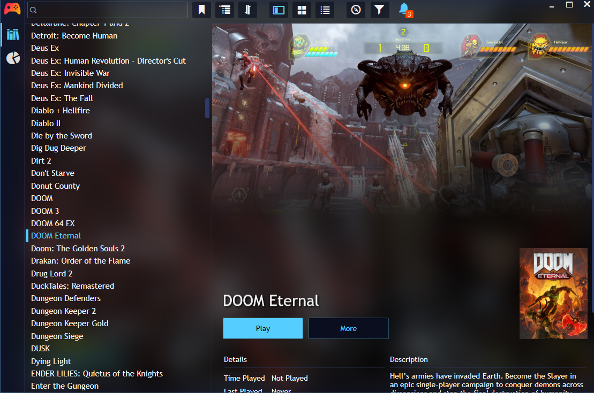
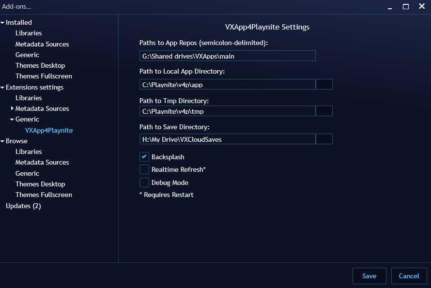
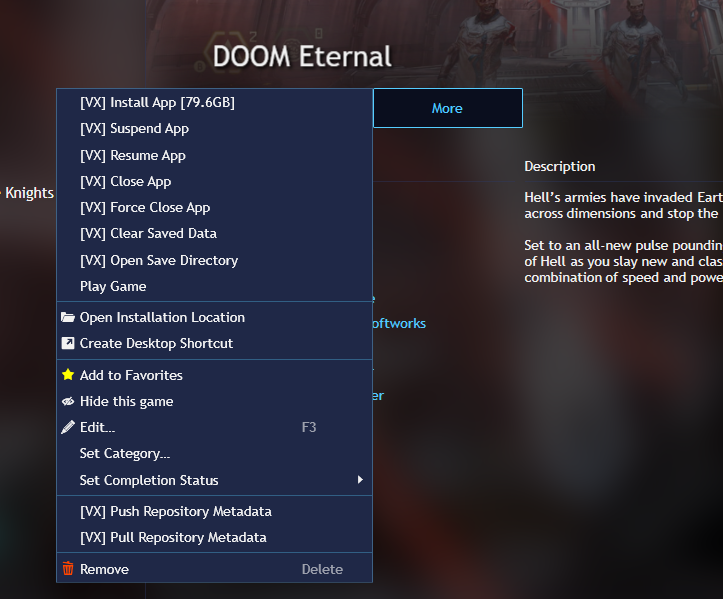
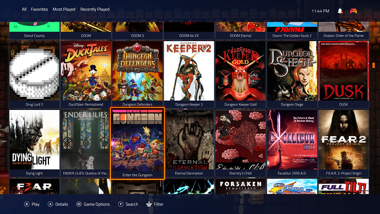

# VXApp4Playnite
A loadable VXApp extension for the Playnite Frontend

This extension supports the vxapp format and isolation layer that I have built to store games with their dependencies and launch in a more portable-friendly experience.

Features:
- Multiple repositories with realtime updates can be specified.
- Controls to copy apps to a cached directory for faster loading.
- Controls to Suspend/Resume an app.
- Controls to clear cache and copy apps.
- Self updating to pull the latest copy of paradox libraries and supporting VXTools.
- Background splashes for loading apps.
- Controls to pull/push metadata updates (e.g. icons, ratings, etc.)

Main Screen:

Settings:

Game-Specific Context Menu:

Fullscreen mode now resembles something more like what we'd see on a console:

